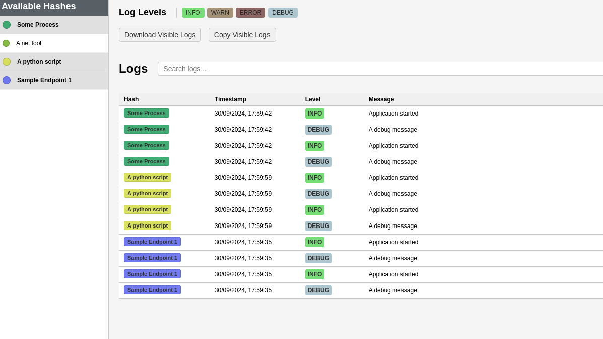

<p align="center">
  
</p>

<h1 align="center">IronLog</h1>

<p align="center">
  <strong>Robust, Multi-Nodal, Real-time Logging for Any Language</strong>
</p>

<p align="center">
  <a href="#key-features">Key Features</a> •
  <a href="#quick-start">Quick Start</a> •
  <a href="#usage">Usage</a> •
  <a href="#why-ironlog">Why IronLog?</a> •
  <a href="#contributing">Contributing</a> •
  <a href="#license">License</a> •
  <a href="#todo">Credits</a>
</p>

---

IronLog is a high-performance, real-time logging solution for Rust applications. Built with reliability and ease-of-use in mind, IronLog empowers developers to gain instant insights into their applications' behavior.

## Key Features

- 🚀 **Real-time Logging**: Stream logs instantly to a centralized server.
- 🔍 **Structured Logging**: JSON-formatted logs for easy parsing and analysis.
- 🔒 **Secure**: Uses TCP for reliable log transmission, you don't have to use rust for the client. 
- 📊 **Web Interface**: Built-in web UI for log viewing and analysis.
- 🔧 **Easy Integration**: Simple setup with minimal code.
- 🔄 **Asynchronous**: Non-blocking logging operations for optimal performance.
- 💾 **Persistent Storage**: Store logs in a database for long-term retention and analysis.

<p align="center">
  
  <br>
  <em>IronLog's intuitive web interface for real-time log viewing and analysis</em>
</p>

## Quick Start

1. Run the log storage and server:
    ```bash
    cargo install ironlog
    ironlog #leave this running in the background or make it a systemd service
    ```

2. Add IronLog to your `Cargo.toml`:
   ```toml
   [dependencies]
   ironlog = "0.2.6"
   ```

3. Initialize IronLog in your main.rs:
   ```rust
   use ironlog::TcpLogger;

   fn main() {
       TcpLogger::init("127.0.0.1:5000", "your-app-name", log::LevelFilter::Info).unwrap();
       
       log::info!("Application started"); //will show up in the web interface
   }
   ```

4. Open your browser and navigate to `http://127.0.0.1:8000` to view the logs.


## Companion & Client Libraries
[ESP32 Client Library (Arduino & Platformio)](https://github.com/heety313/ironlog-esp32-pio)

## Independant Logging

If you dont want to interfear with the default logging in rust or setup multiple loggers in the same program you can do so like this. 
```rust
use ironlog::TcpLogger;

fn main() {
    // Create an instance-specific logger
    let my_logger = TcpLogger::new("127.0.0.1:5000", "instance_hash", false).unwrap();

    // Use instance-specific logger
    my_logger.info("This is an instance-specific log");
}
```

## Usage

IronLog seamlessly integrates with Rust's standard logging facade. Use it just like you would use `log`:


## Why IronLog?

IronLog was created to address the common challenge of managing logs across multiple programs in complex systems. It provides a centralized, efficient solution for developers who need to debug and monitor various applications simultaneously, eliminating the need to create custom parsers or juggle multiple logging tools. With IronLog, you can streamline your logging process, enhance your debugging efficiency, and gain valuable insights into your distributed systems with ease.

## Contributing

Contributions are welcome. If you have an improvement or bug fix, please submit a pull request. Ensure your code is well-tested. We'll review and merge contributions that enhance IronLog's functionality or reliability.

## License

This project is licensed under the MIT License. See the [LICENSE](LICENSE) file for details.

## Todo

- [ ] tests
- [ ] a simple cpp client
- [x] optional log storage and recovery
